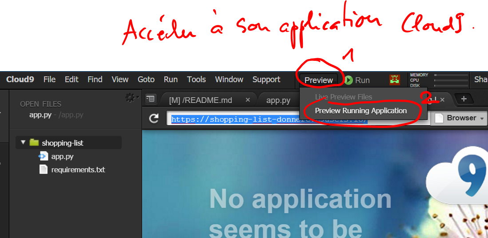

#########################################
TP : Génération de code HTML côté serveur
#########################################

Objectifs
=========

Dans ce TP, nous allons voir comment générer automatiquement du code HTML à
partir de structures de données Python. Toutes les applications Web que vous
utilisez quotidiennement génèrent du code HTML de manière programmatique à
partir de données extraites de grandes bases de données.

Étape 0 : Création d'un workspace sur Cloud9
============================================

Dans cette partie, vous allez démarrer un projet Flask sur Cloud9 et rendre la liste de commissions visibles depuis Internet.

#.  Sur Cloud9, créer un projet ``shopping-list`` de type ``Python``

#.  Supprimer tous les fichiers inutiles avec

    ::

        rm -rf *

#.  Créer un environnement virtuel pour installer les dépendances du projet Flask avec 

    ..  code-block:: bash

        # création de l'environnement virtuel
        virtualenv -p python3 venv

#.  Activer l'environnement virtuel

    ..  code-block:: bash

        source venv/bin/activate

#.  Installer Flask

    ..  code-block:: bash

        pip install flask

#.  Visualiser les dépendances 

    ..  code-block:: bash

        pip freeze

#.  Sauver les dépendances dans le fichier ``requirements.txt`` en redirigeant la sortie standard du processus ``pip`` vers le fichier ``requirements.txt``.

    ..  code-block:: bash

        pip freeze > requirements.txt

#.  Créer un fichier ``.gitignore`` pour lister les fichiers dont il ne faut pas tenir compte dans ``git`` avec le contenu suivant :

    ::

        venv
        __pycache__
        .c9

#.  Créer un dépôt ``git`` pour gérer le code :

    ..  code-block:: bash

        git init

#.  Ajouter les fichiers au dépôt ``git`` et faire le premier commit

    ..  code-block:: bash

        # vérifier qu'on n'ajoute pas de fichier indésirable
        git add . --dry-run

        # faire l'ajout pour de vrai
        git add .

        # faire le premier commit
        git add commit -m "step 0"

Étape 1 : générer une liste à puces
===================================

Créer un module Python 3 ``shopping-list.py`` définissant une fonction
``generate_list(items)`` qui va générer une liste à puces HTML correspondant aux
articles à acheter présents dans l'argument ``items`` :
 
..  code-block:: python

    items = [
        'Salade',
        'Pain',
        'Orange',
        'Poires',
        'Jus de pomme',
        'Fromage Gruyère',
        'Chaussures',
        'Oignons',
    ]

    html = generate_list(items)

Le code HTML devrait ressembler à ceci :

..  code-block:: html
    :linenos:

    <ul class="shopping-list">
        <li class="shopping-item">Salade</li>
        <li class="shopping-item">Pain</li>
        <li class="shopping-item">Orange</li>
        <li class="shopping-item">Poires</li>
        <li class="shopping-item">Jus de pomme</li>
        <li class="shopping-item">Fromage Gruyère</li>
        <li class="shopping-item">Chaussures</li>
        <li class="shopping-item">Oignons</li>
    </ul>

Lors de son exécution, le module doit afficher le code HTML généré sur la sortie standard et sauver le code HTML généré dans un fichier ``shopping.html``.

..  warning::

    Une fois que tout fonctionne, créer un commit avec le message ``step 1``

Étape 2 : Mettre en place un serveur Flask
==========================================

Créer un fichier ``app.py`` qui va contenir notre application Flask permettant de gérer notre liste de commissions. Voici un point de départ 

..  literalinclude:: scripts/flask-starter.py
    :language: python
    :linenos:

Pour démarrer le serveur sur Cloud9, il faut exécuter les commandes suivantes dans le terminal

..  code-block:: bash

    (venv)USER:~/workspace $ export FLASK_APP=app.py
    (venv)USER:~/workspace $ export FLASK_DEBUG=1
    (venv)USER:~/workspace $ python app.py --host=$IP --port=$PORT

Pour visualiser accéder au serveur depuis n'importe quel poste, il faut visiter
l'URL https://shopping-list-USER.c9users.io/ **où USER doit être remplacé par votre nom d'utilisateur Cloud9**. Une autre façon de visualiser votre application est de cliquer sur le menu ``Preview -> Preview running application``.

    Visualisation de l'application Flask une fois le serveur lancé

Vous devriez alors voir apparaître un nouvel onglet avec l'application qui tourne et qui affiche le texte ``Hello, World!``

..  figure:: figures/running-app.png
    :align: center
    :width: 70%

..  warning::

    Une fois que tout fonctionne, créer un commit avec le message ``step 2``

Étape 3 : Générer la liste de commissions sur Flask
===================================================

Dans cette étape, vous allez générer le code HTML côté serveur avec Flask et, au
lieu de l'enregistrer dans un fichier, envoyer le code HTML généré lorsqu'un
navigateur envoie la requête HTTP suivante

::

    GET /items HTTP/1.1

..  tip::

    Pour cela, il faudra définir une nouvelle *route* ``/items`` et retourner le code HTML généré.

    Si vous êtes perdus, consultez la documentation officielle de Flask : http://flask.pocoo.org/docs/0.12/quickstart/

..  warning::

    Une fois que tout fonctionne, créer un commit avec le message ``step 3``

Étape 4 : Utiliser un template pour générer le code HTML
========================================================

Au lieu de générer le code HTML à la main, il est conseillé d'utiliser un
gabarit (*template* en anglais). 

..  tip::

    *   Documentation rapide pour effectuer le rendu de templates : http://jinja.pocoo.org/docs/2.9/templates/
    *   Documentation complète de la syntaxe des templates Jinja : http://jinja.pocoo.org/docs/2.9/templates/

#.  Lire la section http://jinja.pocoo.org/docs/2.9/templates/ sur les templates Jinja et leur utilisation dans Flask.

#.  Créer le fichier ``templates/items.html`` avec le contenu de départ suivant :

    ..  code-block:: jinja2

        <ul>
            {{ items }}
        </ul>

#.  Effectuer le rendu de la liste de commissions à l'aide d'un gabarit Jinja2
``items.html`` en passant l'objet ``items`` à la fonction
``render_template('items.html', items=... )``

#.  En visitant la route ``/items`` vous devriez voir la liste de commissions s'afficher dans un navigateur.

..  warning::

    Une fois que tout fonctionne, créer un commit avec le message ``step 4``

Étape 5 : Générer un tableau (liste de vins)
============================================

..  comment::

    Défis à réaliser à la maison
    ============================

    Génération de liste récursive
    -----------------------------
    
    Améliorer votre programme précédent pour qu'il génère une liste de commissions
    hiérarchisée par rayons à partir de la liste suivante :
    
    ..  code-block:: python

        commissions2 = [
            'Légumes',
                [
                'Salade',
                'carottes',
                'poireaux',
                ],
            'Fruits',
                [
                    'Oranges',
                    'Pommes',
                    'Poires',
                    'Mandarines',
                ],
            'Habits',
                [
                'Hommes',
                    [
                        'Pantalon',
                        'Chaussures',
                    ],
                'Dames',
                    [
                        'Robe',
                        'hauts-talons',
                        ],
                ],
        ]

    Liste de commissions hiérarchisée (rendu HTML)
    ++++++++++++++++++++++++++++++++++++++++++++++
    
    * Légumes
        * Salade
        * carottes
        * poireaux
    * Fruits
        * Oranges
        * Pommes
        * Poires
        * Mandarines
    * Habits
        * Hommes
            * Pantalon
            * Chaussures
        * Dames
            * Robe
            * hauts-talons
            
    ..  admonition:: Remarque

        Les deux formats de liste hiérarchisée suivants sont possibles, bien que
        le premier soit recommandé. Le premier est cependant moins facile à
        générer à partir de la liste donnée

        **Version recommandée**

        ..  code-block:: html

            <ul>
                <li>Légumes
                    <ul>
                        <li>Poireaux</li>
                        <li>Choux</li>
                    </ul>
                </li>
            </ul>

        **Version plus facile**

        ..  code-block:: html

            <ul>
                <li>Légumes</li>
                <li>
                    <ul>
                        <li>Poireaux</li>
                        <li>Choux</li>
                    </ul>
                </li>
            </ul>

    Corrigé des exercices
    =====================

    Les corrigés sont disponibles dans GitHub sous https://github.com/oci1315/webdev/blob/master/corrige/generation_html/generate_lists.py. La solution utilise la technique de template dont le moteur est développé dans le fichier ``template.py`` se trouvant dans le même dossier.